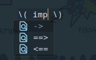

# 文：中文 LSP 服务的尝试

这是一个实验性的包，当前还无法达到能够日常使用的状态，建议用一个特定的 conda 环境来运行或开发，不影响到系统的 python 环境.

## 环境

在最近一次更新后，python 环境要求 torch2.0，python3.11，transfomers, pygls 默认最新版即可。

以下是用 conda 安装名为 torch2 的环境的脚本

```bash
env_name=torch2
conda create --name ${env_name} python=3.11 -y
conda activate ${env_name}
conda install pytorch torchvision torchaudio cpuonly -c pytorch
# 如果有 nvidia 的 GPU 使用以下行替换上一行,或参考 torch官网
# conda install pytorch torchvision torchaudio pytorch-cuda=11.7 -c pytorch -c nvidia
conda install black pandas
pip install transformers click pypinyin pygls jieba pinyinsplit
```

接着下载库到本地, 以下示范路径为 `~/codes/wen`：

```
git clone git@github.com:metaescape/Wen.git ~/codes/wen
```

## 配置

在 `~/.config/wen` 中新建 setting.json，样例如下

```json
{
  "latex.table.path": "~/.config/wen/latex_table.txt",
  "debug": false,
  "completion": "gpt2",
  "use_pinyin_initial": true,
  "model_path": "/data/database/models/gpt2-zh-21k",
  "python_path": "/home/pipz/miniconda3/envs/torch2/bin/python"
}
```

解释

- `latex.table.path`: latex 缩写表
- `debug`: 是否开启 debug 日志，文件在 `/tmp/wen.log`
- `completion`： 可选 gpt2 或者 demo, 模块见后文
- `use_pinyin_initial`: 是否对文档里的词组进行扫描并构建一个拼音首字母缩写到词组的映射表，见后文
- `model_path`: gpt2 的路径，详见下一节
- "python_path": python 可以执行的路径，填写上 conda 路径，否则使用默认的 `/usr/bin/python3`

## 安装和启动

```
python install.py init
```

在 emacs org-mode 里执行 lsp-bridge-mode 启动 lsp 服务

## Completion（输入法）模块

wenls 当前支持两种输入法，目前都只能支持全拼输入:

1. 使用隐马尔可夫模型, 基于 https://github.com/whatbeg/GodTian_Pinyin。

执行以下命令会自动下载：

```
python install.py demo
```

同时修改 ~/.config/wen/setting.json 中为 "completion": "demo",

2. 使用 gpt2, 基于 https://github.com/VisualJoyce/Transformers4IME.
   使用该输入法不需要额外的安装命令, 但第一次启动 wenlsp 会自动从 huggingface 下载模型，如果网络比较慢，
   可以到 https://huggingface.co/aihijo/gpt2-zh-21k 手动下载模型, 然后修改 ~/.config/wen/setting.js 中的 `model_path="/path/to/gpt2-zh-21k"`

   该模型占用内存在 500M-1G 左右，因此有一定硬件要求。在 cpu 上做 beamsearch 效率不高有点延迟，拼音切分导致的问题偶尔也会存在，但长句输入很有优势，尤其是在已经有前文的情况下。

## 拼音首字母补全模块

该模块会读取已经打开的文档内容，提取出其中的名词词组(两个连续的名词)加入到候选词库，例如打开的 buffer 中如果包括 "武侠小说", 那么输入 wxxs 就可以补全出这个词

选择的策略是一个令人头疼的问题，这里选用两个连续名词组成的词组（也许并不是词组）只是作为功能展示，和以上输入法一样。

## latex 提示模块

如果在 `setting.json` 中指定了 `latex.table.path` 路径的话，
当在 org 中进入 `\( \)` 和 `\[ \]` 包裹的 inline latex 环境时，会触发提示，如下图所示，选择之后会插入 `\rightarrow`



个人使用的 "~/.config/wen/latex_table.txt" 如下：

```
nentails ⊭ \nvDash
imply -> \rightarrow
implies ==> \implies
impliedby <== \impliedby
rightarrow -> \rightarrow
rightarrow ==> \implies
infer ⊢ \vdash
ninfer ⊬ \nvdash
summation ∑ \sum
integral ∫ \int
integral ∫∫∫ \iiint
integral ∫∫ \iint
product ∏ \prod
forall ∀ \forall
all ∀ \forall
exists ∃ \exists
nexists ∄ \nexists
empty ∅ \emptyset
approx ≈ \approx
+infinity +∞ +\infty
-infinity -∞ -\infty
equalsim ≈ \approx
equivalent ≡ \equiv
equallogic <-> \leftrightarrow
equallogic <==> \iff
equallogic <=> \Leftrightarrow
leftangle ⟨ \langle
rightangle ⟩ \rangle
leftceil ⌈ \lceil
rightceil ⌉ \rceil
leftfloor ⌊ \lfloor
rightfloor ⌋ \rfloor
brace || \|
perpendicular ⟘ \bot
perpendicular ⟘ \bigbot
perpendicular ⫫ \Bot
chuizhi ⟘ \bot
chuizhi ⟘ \bigbot
chuizhi ⫫ \Bot
shizi † \dagger
ten † \dagger
star * \star
... ⋯ \cdot
```
